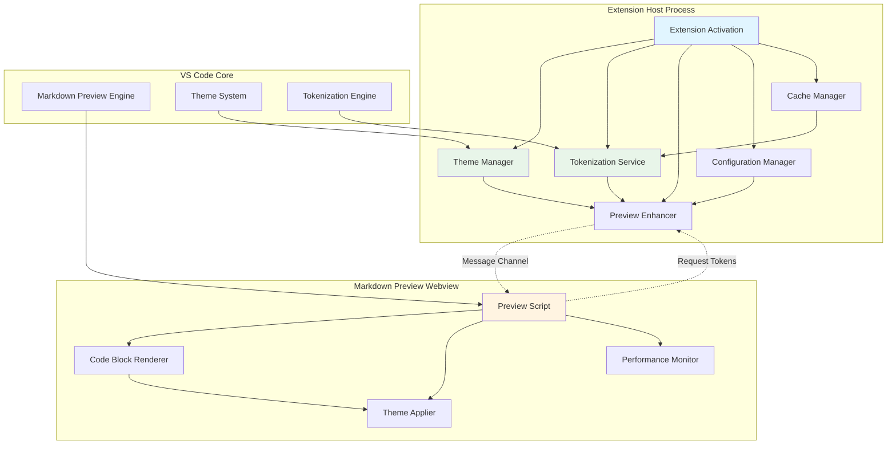
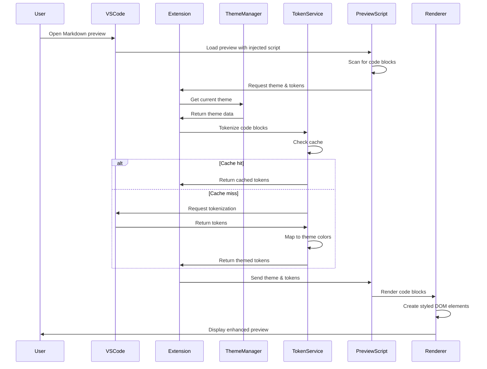
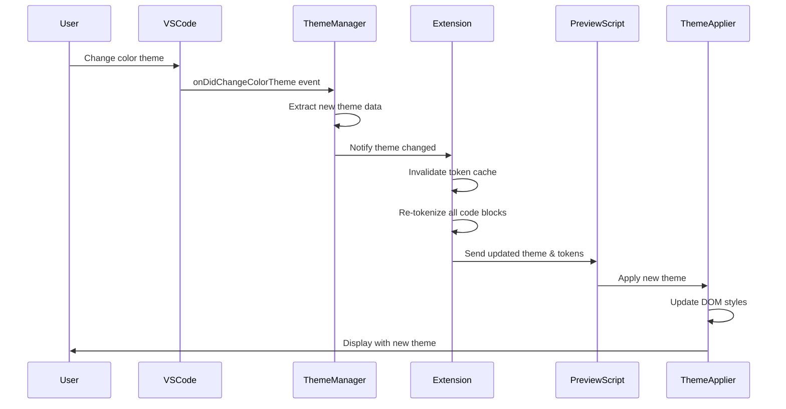

# Theme-Aware Markdown Syntax Highlighting Extension
## Architecture Design Document

---

## 1. Executive Summary

This document defines the architecture for a Visual Studio Code extension that enhances Markdown preview with theme-aware syntax highlighting for fenced code blocks. The extension intercepts the Markdown preview rendering pipeline, applies syntax highlighting synchronized with the active VS Code color theme, and dynamically updates when users switch themes.

### Key Architectural Decisions

- **Extension Point Strategy**: Use `markdown.previewScripts` for JavaScript injection to modify preview DOM
- **Theme Synchronization**: Leverage webview messaging to communicate theme tokens from extension host to preview context
- **Tokenization Approach**: Use VS Code's TextMate tokenization API on extension host side, serialize tokens and pass to preview
- **Performance**: Implement incremental rendering, caching, and virtual scrolling for large documents
- **Fallback Strategy**: Use CSS-based fallback highlighting when theme information is unavailable

---

## 2. Extension Structure and File Organization

```
markdown-theme-highlight/
├── src/
│   ├── extension.ts                 # Extension entry point, activation
│   ├── themeManager.ts              # Theme detection and synchronization
│   ├── tokenizationService.ts       # Code tokenization using TextMate grammars
│   ├── previewEnhancer.ts           # Manages preview enhancement logic
│   ├── configurationManager.ts      # User settings and preferences
│   ├── cacheManager.ts              # Token and theme caching
│   └── preview/
│       ├── previewScript.ts         # Injected script in preview webview
│       ├── codeBlockRenderer.ts     # DOM manipulation for code blocks
│       ├── themeApplier.ts          # Apply theme tokens to code elements
│       └── performanceMonitor.ts    # Performance tracking and optimization
├── styles/
│   ├── fallback-light.css           # Fallback styles for light themes
│   ├── fallback-dark.css            # Fallback styles for dark themes
│   └── code-block-base.css          # Base styles for code blocks
├── resources/
│   └── icons/
│       └── extension-icon.png
├── package.json                      # Extension manifest
├── tsconfig.json                     # TypeScript configuration
├── webpack.config.js                 # Bundling configuration
└── README.md                         # User documentation
```

### File Responsibilities

| File | Purpose | Key Functions |
|------|---------|---------------|
| `extension.ts` | Extension lifecycle management | `activate()`, `deactivate()` |
| `themeManager.ts` | Theme detection and change handling | `getCurrentTheme()`, `onThemeChange()`, `getThemeTokens()` |
| `tokenizationService.ts` | Code tokenization | `tokenizeCode()`, `getLanguageGrammar()`, `mapTokensToTheme()` |
| `previewEnhancer.ts` | Coordinate enhancement logic | `enhancePreview()`, `updateAllPreviews()` |
| `previewScript.ts` | Client-side preview enhancement | `scanCodeBlocks()`, `applyHighlighting()`, `listenForThemeUpdates()` |
| `codeBlockRenderer.ts` | DOM manipulation | `renderCodeBlock()`, `createTokenElements()`, `updateStyles()` |
| `themeApplier.ts` | Apply theme colors | `applyThemeTokens()`, `generateCSS()` |
| `cacheManager.ts` | Performance optimization | `cacheTokens()`, `getCachedTokens()`, `invalidateCache()` |

---

## 3. Key VS Code APIs and Extension Points

### 3.1 Extension Contribution Points

```json
{
  "contributes": {
    "markdown.previewScripts": [
      "./dist/preview/previewScript.js"
    ],
    "markdown.previewStyles": [
      "./styles/code-block-base.css",
      "./styles/fallback-light.css",
      "./styles/fallback-dark.css"
    ],
    "configuration": {
      "title": "Markdown Theme Highlight",
      "properties": {
        "markdownThemeHighlight.enableHighlighting": {
          "type": "boolean",
          "default": true,
          "description": "Enable theme-aware syntax highlighting in Markdown preview"
        },
        "markdownThemeHighlight.fontFamily": {
          "type": "string",
          "default": "",
          "description": "Font family for code blocks (empty uses VS Code default)"
        },
        "markdownThemeHighlight.fontSize": {
          "type": "number",
          "default": 0,
          "description": "Font size for code blocks (0 uses VS Code default)"
        },
        "markdownThemeHighlight.lineHeight": {
          "type": "number",
          "default": 1.5,
          "description": "Line height multiplier for code blocks"
        },
        "markdownThemeHighlight.enableCache": {
          "type": "boolean",
          "default": true,
          "description": "Enable caching of tokenized code blocks"
        },
        "markdownThemeHighlight.maxCacheSize": {
          "type": "number",
          "default": 100,
          "description": "Maximum number of cached code blocks"
        }
      }
    }
  }
}
```

### 3.2 Core VS Code APIs

#### Theme API
```typescript
import * as vscode from 'vscode';

// Listen for theme changes
vscode.window.onDidChangeColorTheme((theme: vscode.ColorTheme) => {
  // Update all previews with new theme
  handleThemeChange(theme);
});

// Get current theme
const currentTheme = vscode.window.activeColorTheme;
const themeKind = currentTheme.kind; // Light, Dark, HighContrast, HighContrastLight
```

#### Tokenization API
```typescript
import * as vscode from 'vscode';

// Get tokens for code
const document = await vscode.workspace.openTextDocument({
  language: 'typescript',
  content: codeContent
});

const tokens = await vscode.languages.tokenizeDocument(document);
```

#### Webview Messaging
```typescript
// Extension host → Preview webview
postMessage({
  type: 'updateTheme',
  theme: themeData,
  tokens: tokenizedCode
});

// Preview webview → Extension host
window.addEventListener('message', event => {
  const message = event.data;
  switch (message.type) {
    case 'requestTokens':
      // Process request
      break;
  }
});
```

---

## 4. Component Architecture



### 4.1 Component Descriptions

#### Extension Host Components

**Theme Manager**
- Monitors active color theme
- Extracts theme token colors using TextMate scope resolution
- Handles theme change events
- Converts theme data to serializable format for webview

**Tokenization Service**
- Tokenizes code using VS Code's TextMate grammar engine
- Maps tokens to theme-specific colors
- Handles all supported language grammars
- Provides fallback for unsupported languages

**Preview Enhancer**
- Orchestrates communication between extension host and preview
- Manages message passing
- Coordinates updates across multiple preview instances
- Handles preview lifecycle events

**Configuration Manager**
- Reads user preferences
- Validates configuration values
- Provides configuration to other components
- Watches for configuration changes

**Cache Manager**
- Caches tokenized code blocks with hash keys
- Implements LRU eviction strategy
- Invalidates cache on theme changes
- Persists cache metadata for performance

#### Preview Webview Components

**Preview Script**
- Entry point for preview enhancement
- Scans document for fenced code blocks
- Listens for messages from extension host
- Coordinates code block rendering

**Code Block Renderer**
- Manipulates DOM to replace code block content
- Creates styled span elements for tokens
- Preserves accessibility attributes
- Handles incremental updates

**Theme Applier**
- Applies theme colors to rendered tokens
- Generates inline styles or CSS rules
- Handles theme transitions smoothly
- Manages fallback styles

**Performance Monitor**
- Tracks rendering performance metrics
- Implements virtual scrolling for large documents
- Throttles updates during rapid theme changes
- Reports performance data

---

## 5. Data Flow

### 5.1 Initial Preview Enhancement Flow



### 5.2 Theme Change Flow



### 5.3 Data Structures

#### Theme Data Schema
```typescript
interface ThemeData {
  kind: 'light' | 'dark' | 'highContrast' | 'highContrastLight';
  colors: {
    [scope: string]: string; // TextMate scope → color mapping
  };
  fontFamily: string;
  fontSize: number;
  lineHeight: number;
}
```

#### Token Data Schema
```typescript
interface TokenizedCode {
  language: string;
  code: string;
  codeHash: string; // For cache invalidation
  lines: TokenLine[];
}

interface TokenLine {
  text: string;
  tokens: Token[];
}

interface Token {
  text: string;
  scopes: string[]; // TextMate scopes
  color: string;     // Resolved theme color
  fontStyle?: 'italic' | 'bold' | 'underline';
}
```

#### Message Protocol
```typescript
// Extension → Preview
interface ThemeUpdateMessage {
  type: 'updateTheme';
  theme: ThemeData;
  blocks: Map<string, TokenizedCode>; // blockId → tokens
}

// Preview → Extension
interface TokenRequestMessage {
  type: 'requestTokens';
  blocks: CodeBlockInfo[];
}

interface CodeBlockInfo {
  id: string;         // Unique identifier for cache
  language: string;
  code: string;
  codeHash: string;
}
```

---

## 6. Strategy for Intercepting and Enhancing Markdown Preview

### 6.1 Injection Mechanism

The extension uses the `markdown.previewScripts` contribution point to inject JavaScript into the Markdown preview webview. This script executes in the preview context with access to the DOM.

```typescript
// previewScript.ts (runs in preview webview)
(function() {
  'use strict';
  
  // Establish communication with extension host
  const vscode = acquireVsCodeApi();
  
  // Wait for DOM ready
  if (document.readyState === 'loading') {
    document.addEventListener('DOMContentLoaded', initialize);
  } else {
    initialize();
  }
  
  function initialize() {
    scanAndEnhanceCodeBlocks();
    observeDOMChanges();
    listenForThemeUpdates();
  }
})();
```

### 6.2 Code Block Detection

The preview script scans the DOM for code blocks using CSS selectors:

```typescript
function scanCodeBlocks(): CodeBlockInfo[] {
  const codeBlocks: CodeBlockInfo[] = [];
  
  // Select all fenced code blocks
  const blocks = document.querySelectorAll('pre > code[class*="language-"]');
  
  blocks.forEach((block, index) => {
    const pre = block.parentElement as HTMLPreElement;
    const language = extractLanguage(block.className);
    const code = block.textContent || '';
    const hash = hashCode(code);
    const blockId = `block-${index}-${hash}`;
    
    // Store reference for later enhancement
    block.setAttribute('data-block-id', blockId);
    
    codeBlocks.push({
      id: blockId,
      language,
      code,
      codeHash: hash
    });
  });
  
  return codeBlocks;
}

function extractLanguage(className: string): string {
  const match = className.match(/language-(\w+)/);
  return match ? match[1] : 'plaintext';
}
```

### 6.3 DOM Mutation Observation

Monitor DOM changes for dynamically updated content:

```typescript
function observeDOMChanges() {
  const observer = new MutationObserver((mutations) => {
    let needsUpdate = false;
    
    for (const mutation of mutations) {
      if (mutation.type === 'childList' || mutation.type === 'characterData') {
        needsUpdate = true;
        break;
      }
    }
    
    if (needsUpdate) {
      // Debounce to avoid excessive processing
      debounce(() => scanAndEnhanceCodeBlocks(), 250)();
    }
  });
  
  observer.observe(document.body, {
    childList: true,
    subtree: true,
    characterData: true
  });
}
```

### 6.4 Progressive Enhancement

The extension preserves the original Markdown preview functionality:

1. **Non-intrusive**: Original code blocks remain functional if extension fails
2. **Graceful degradation**: Falls back to default preview if highlighting unavailable
3. **Accessibility**: Maintains semantic HTML structure and ARIA attributes
4. **Copy-paste**: Preserves plain text when users copy code

---

## 7. Approach for Dynamic Theme Switching

### 7.1 Theme Change Detection

```typescript
// themeManager.ts (extension host)
export class ThemeManager {
  private currentTheme: ThemeData | null = null;
  private onThemeChangeEmitter = new vscode.EventEmitter<ThemeData>();
  
  constructor() {
    // Listen for theme changes
    vscode.window.onDidChangeColorTheme(this.handleThemeChange.bind(this));
    
    // Initialize with current theme
    this.updateCurrentTheme();
  }
  
  private async handleThemeChange(theme: vscode.ColorTheme): Promise<void> {
    const newThemeData = await this.extractThemeData(theme);
    this.currentTheme = newThemeData;
    this.onThemeChangeEmitter.fire(newThemeData);
  }
  
  private async extractThemeData(theme: vscode.ColorTheme): Promise<ThemeData> {
    // Extract token colors from active theme
    const tokenColors = await this.getTokenColors();
    
    return {
      kind: this.mapThemeKind(theme.kind),
      colors: tokenColors,
      fontFamily: this.getFontFamily(),
      fontSize: this.getFontSize(),
      lineHeight: this.getLineHeight()
    };
  }
  
  private async getTokenColors(): Promise<Record<string, string>> {
    // Use VS Code's theme token color resolution
    // Map common TextMate scopes to colors
    const scopes = [
      'comment',
      'string',
      'keyword',
      'variable',
      'function',
      'class',
      'constant',
      'operator',
      // ... more scopes
    ];
    
    const colors: Record<string, string> = {};
    
    for (const scope of scopes) {
      // This is conceptual - actual implementation uses undocumented APIs
      // or falls back to CSS variable extraction
      const color = await this.getColorForScope(scope);
      if (color) {
        colors[scope] = color;
      }
    }
    
    return colors;
  }
}
```

### 7.2 Smooth Theme Transitions

Apply CSS transitions for smooth visual updates:

```css
/* code-block-base.css */
.theme-highlight-token {
  transition: color 0.2s ease, background-color 0.2s ease;
}

.theme-highlight-block {
  transition: background-color 0.2s ease;
}
```

### 7.3 Batched Updates

Prevent excessive re-rendering during rapid theme changes:

```typescript
// previewScript.ts
class ThemeUpdateBatcher {
  private pendingUpdate: ThemeData | null = null;
  private timeoutId: number | null = null;
  
  scheduleUpdate(theme: ThemeData) {
    this.pendingUpdate = theme;
    
    if (this.timeoutId !== null) {
      clearTimeout(this.timeoutId);
    }
    
    this.timeoutId = setTimeout(() => {
      if (this.pendingUpdate) {
        this.applyThemeUpdate(this.pendingUpdate);
        this.pendingUpdate = null;
      }
      this.timeoutId = null;
    }, 100); // 100ms debounce
  }
  
  private applyThemeUpdate(theme: ThemeData) {
    // Apply theme to all code blocks
    const blocks = document.querySelectorAll('[data-block-id]');
    blocks.forEach(block => updateBlockTheme(block, theme));
  }
}
```

---

## 8. Performance Optimization Strategies

### 8.1 Caching Strategy

**Multi-level Cache:**

```typescript
// cacheManager.ts
export class CacheManager {
  private tokenCache: LRUCache<string, TokenizedCode>;
  private themeCache: Map<string, ThemeData>;
  
  constructor(maxSize: number = 100) {
    this.tokenCache = new LRUCache(maxSize);
    this.themeCache = new Map();
  }
  
  // Cache key: hash(code + language + themeId)
  getCachedTokens(code: string, language: string, themeId: string): TokenizedCode | null {
    const key = this.generateKey(code, language, themeId);
    return this.tokenCache.get(key);
  }
  
  cacheTokens(code: string, language: string, themeId: string, tokens: TokenizedCode) {
    const key = this.generateKey(code, language, themeId);
    this.tokenCache.set(key, tokens);
  }
  
  invalidateTheme(themeId: string) {
    // Remove all cached tokens for this theme
    this.tokenCache.clear(); // Or selective removal
    this.themeCache.delete(themeId);
  }
  
  private generateKey(code: string, language: string, themeId: string): string {
    return `${language}:${themeId}:${this.hash(code)}`;
  }
  
  private hash(str: string): string {
    // Simple hash function
    let hash = 0;
    for (let i = 0; i < str.length; i++) {
      const char = str.charCodeAt(i);
      hash = ((hash << 5) - hash) + char;
      hash = hash & hash; // Convert to 32-bit integer
    }
    return hash.toString(36);
  }
}
```

### 8.2 Incremental Rendering

**Virtual Scrolling for Large Documents:**

```typescript
// performanceMonitor.ts
class VirtualScrollManager {
  private visibleRange: { start: number; end: number } = { start: 0, end: 10 };
  private allBlocks: HTMLElement[] = [];
  
  initialize(blocks: HTMLElement[]) {
    this.allBlocks = blocks;
    this.updateVisibleRange();
    this.setupScrollListener();
  }
  
  private setupScrollListener() {
    let ticking = false;
    
    window.addEventListener('scroll', () => {
      if (!ticking) {
        window.requestAnimationFrame(() => {
          this.updateVisibleRange();
          ticking = false;
        });
        ticking = true;
      }
    });
  }
  
  private updateVisibleRange() {
    const viewportHeight = window.innerHeight;
    const scrollTop = window.scrollY;
    const buffer = viewportHeight; // Render buffer above/below viewport
    
    // Determine which blocks are visible
    this.allBlocks.forEach((block, index) => {
      const rect = block.getBoundingClientRect();
      const blockTop = rect.top + scrollTop;
      const blockBottom = blockTop + rect.height;
      
      const isVisible = 
        blockBottom >= scrollTop - buffer &&
        blockTop <= scrollTop + viewportHeight + buffer;
      
      if (isVisible && !block.hasAttribute('data-rendered')) {
        this.renderBlock(block);
      } else if (!isVisible && block.hasAttribute('data-rendered')) {
        this.unrenderBlock(block);
      }
    });
  }
  
  private renderBlock(block: HTMLElement) {
    // Render full highlighting
    block.setAttribute('data-rendered', 'true');
  }
  
  private unrenderBlock(block: HTMLElement) {
    // Optionally remove detailed rendering to save memory
    // Keep basic structure for layout
  }
}
```

### 8.3 Lazy Tokenization

Only tokenize visible code blocks:

```typescript
// tokenizationService.ts
export class TokenizationService {
  private queue: CodeBlockInfo[] = [];
  private processing = false;
  
  async tokenizeBatch(blocks: CodeBlockInfo[], priority: boolean = false) {
    if (priority) {
      this.queue.unshift(...blocks);
    } else {
      this.queue.push(...blocks);
    }
    
    if (!this.processing) {
      this.processingQueue();
    }
  }
  
  private async processingQueue() {
    this.processing = true;
    
    while (this.queue.length > 0) {
      const block = this.queue.shift()!;
      
      // Check cache first
      const cached = this.cache.getCachedTokens(
        block.code,
        block.language,
        this.currentThemeId
      );
      
      if (cached) {
        this.sendToPreview(block.id, cached);
        continue;
      }
      
      // Tokenize
      const tokens = await this.tokenize(block.code, block.language);
      
      // Cache result
      this.cache.cacheTokens(
        block.code,
        block.language,
        this.currentThemeId,
        tokens
      );
      
      // Send to preview
      this.sendToPreview(block.id, tokens);
      
      // Yield to prevent blocking
      await this.sleep(0);
    }
    
    this.processing = false;
  }
  
  private sleep(ms: number): Promise<void> {
    return new Promise(resolve => setTimeout(resolve, ms));
  }
}
```

### 8.4 Web Worker for Tokenization (Future Enhancement)

For extremely large code blocks, offload tokenization to a web worker:

```typescript
// tokenizationWorker.ts
// This would require packaging TextMate grammars for worker context
self.addEventListener('message', async (event) => {
  const { code, language, grammar, theme } = event.data;
  
  // Perform tokenization in worker
  const tokens = await tokenizeInWorker(code, language, grammar, theme);
  
  self.postMessage({ tokens });
});
```

### 8.5 Performance Metrics

Track and optimize based on metrics:

```typescript
interface PerformanceMetrics {
  tokenizationTime: number;      // Time to tokenize code
  renderingTime: number;          // Time to update DOM
  totalBlocks: number;            // Number of code blocks
  cachedBlocks: number;           // Cache hit rate
  themeChangeLatency: number;    // Time to update after theme change
}
```

---

## 9. Fallback Mechanisms for Edge Cases

### 9.1 Fallback Hierarchy

1. **Full theme-aware highlighting** (primary)
2. **CSS-based generic highlighting** (partial fallback)
3. **Original Markdown preview** (complete fallback)

### 9.2 Unsupported Language Fallback

```typescript
function getFallbackHighlighting(language: string): string {
  const fallbackMap: Record<string, string> = {
    'unknown': 'plaintext',
    'text': 'plaintext',
    // Map obscure languages to similar supported ones
    'coffeescript': 'javascript',
    'vue': 'html',
    'tsx': 'typescript'
  };
  
  return fallbackMap[language] || 'plaintext';
}
```

### 9.3 Theme Data Unavailable

Use CSS variables and fallback colors:

```css
/* fallback-light.css */
.theme-highlight-block {
  background-color: var(--vscode-textCodeBlock-background, #f5f5f5);
  color: var(--vscode-editor-foreground, #333333);
}

.theme-highlight-token.keyword {
  color: var(--vscode-symbolIcon-keywordForeground, #0000ff);
}

.theme-highlight-token.string {
  color: var(--vscode-symbolIcon-stringForeground, #a31515);
}

.theme-highlight-token.comment {
  color: var(--vscode-symbolIcon-textForeground, #008000);
  font-style: italic;
}
```

### 9.4 Extension Failure

If the extension fails to load or crashes:

```typescript
// previewScript.ts
function safeInitialize() {
  try {
    initialize();
  } catch (error) {
    console.error('Theme highlight extension error:', error);
    // Don't break Markdown preview
    // Original preview remains functional
  }
}

// Timeout for initialization
const initTimeout = setTimeout(() => {
  console.warn('Theme highlight initialization timeout - using fallback');
  applyFallbackStyles();
}, 5000);
```

### 9.5 Large Document Protection

Disable enhancement for extremely large documents:

```typescript
const MAX_BLOCKS_FOR_ENHANCEMENT = 100;
const MAX_CODE_BLOCK_SIZE = 50000; // characters

function shouldEnhanceBlock(block: CodeBlockInfo): boolean {
  if (block.code.length > MAX_CODE_BLOCK_SIZE) {
    console.warn(`Code block too large (${block.code.length} chars), skipping enhancement`);
    return false;
  }
  return true;
}

function shouldEnhanceDocument(blocks: CodeBlockInfo[]): boolean {
  if (blocks.length > MAX_BLOCKS_FOR_ENHANCEMENT) {
    console.warn(`Too many code blocks (${blocks.length}), skipping enhancement`);
    return false;
  }
  return true;
}
```

---

## 10. Technology Stack and Dependencies

### 10.1 Core Technologies

| Technology | Version | Purpose |
|------------|---------|---------|
| TypeScript | ^5.0.0 | Primary development language |
| VS Code Extension API | ^1.80.0 | Extension development framework |
| Node.js | >=16.0.0 | Development environment |

### 10.2 Dependencies

```json
{
  "dependencies": {
    "vscode": "^1.80.0",
    "vscode-textmate": "^9.0.0",
    "oniguruma": "^2.0.0"
  },
  "devDependencies": {
    "@types/node": "^20.0.0",
    "@types/vscode": "^1.80.0",
    "typescript": "^5.0.0",
    "webpack": "^5.0.0",
    "webpack-cli": "^5.0.0",
    "ts-loader": "^9.0.0",
    "eslint": "^8.0.0",
    "@typescript-eslint/parser": "^6.0.0",
    "@typescript-eslint/eslint-plugin": "^6.0.0"
  }
}
```

### 10.3 VS Code APIs Used

- **Core APIs:**
  - `vscode.window.activeColorTheme` - Get current theme
  - `vscode.window.onDidChangeColorTheme` - Theme change events
  - `vscode.workspace.getConfiguration` - User settings
  - `vscode.workspace.onDidChangeConfiguration` - Settings changes

- **Language APIs:**
  - `vscode.languages.getLanguages` - Get supported languages
  - TextMate grammar access (via internal APIs)

- **Extension APIs:**
  - Markdown extension points (`markdown.previewScripts`, `markdown.previewStyles`)

### 10.4 Build Tools

```javascript
// webpack.config.js
module.exports = {
  target: 'node',
  entry: {
    extension: './src/extension.ts',
    previewScript: './src/preview/previewScript.ts'
  },
  output: {
    path: path.resolve(__dirname, 'dist'),
    filename: '[name].js',
    libraryTarget: 'commonjs2'
  },
  externals: {
    vscode: 'commonjs vscode'
  },
  resolve: {
    extensions: ['.ts', '.js']
  },
  module: {
    rules: [
      {
        test: /\.ts$/,
        use: 'ts-loader',
        exclude: /node_modules/
      }
    ]
  }
};
```

---

## 11. Implementation Phases and Sequence

### Phase 1: Foundation and Setup
**Goal:** Establish project structure and basic extension scaffold

**Tasks:**
- Initialize project with TypeScript and VS Code extension template
- Set up build configuration (webpack, tsconfig)
- Create file structure as defined in Section 2
- Implement basic extension activation and deactivation
- Add contribution points to package.json
- Create basic CSS fallback stylesheets

**Deliverables:**
- Extension loads in VS Code
- Contribution points registered
- Build process functional

**Dependencies:** None

---

### Phase 2: Theme Management System
**Goal:** Implement theme detection and synchronization

**Tasks:**
- Implement `ThemeManager` class
- Create theme change event listener
- Extract theme data from active VS Code theme
- Map common TextMate scopes to theme colors
- Implement theme data serialization for webview communication
- Handle all theme kinds (light, dark, high contrast)

**Deliverables:**
- Theme changes detected reliably
- Theme data extracted and serializable
- Event system for theme updates

**Dependencies:** Phase 1

---

### Phase 3: Tokenization Service
**Goal:** Implement code tokenization using VS Code's TextMate engine

**Tasks:**
- Implement `TokenizationService` class
- Create document wrapper for tokenization
- Map tokens to theme colors
- Implement token data structures
- Add language detection and fallback logic
- Test with major languages (JavaScript, TypeScript, Python, Java, C++, etc.)

**Deliverables:**
- Code successfully tokenized for all major languages
- Tokens mapped to theme colors
- Fallback handling for unsupported languages

**Dependencies:** Phase 2

---

### Phase 4: Cache System
**Goal:** Implement caching for performance optimization

**Tasks:**
- Implement `CacheManager` with LRU eviction
- Create cache key generation (hash-based)
- Implement cache invalidation on theme change
- Add cache size limits and configuration
- Test cache hit rates and performance gains

**Deliverables:**
- Functional LRU cache
- Significant performance improvement for repeated code blocks
- Configurable cache settings

**Dependencies:** Phase 3

---

### Phase 5: Preview Script Injection
**Goal:** Inject and execute enhancement script in preview webview

**Tasks:**
- Implement `previewScript.ts` entry point
- Create code block scanner with DOM queries
- Establish message channel with extension host
- Implement code block identification and hashing
- Request tokens from extension host
- Handle script initialization and errors

**Deliverables:**
- Script loads in preview webview
- Code blocks detected and identified
- Communication with extension host working

**Dependencies:** Phase 1, Phase 3

---

### Phase 6: Code Block Rendering
**Goal:** Render highlighted code blocks in preview

**Tasks:**
- Implement `CodeBlockRenderer` class
- Create token-to-DOM conversion logic
- Generate styled span elements for each token
- Preserve semantic HTML structure
- Maintain accessibility attributes
- Handle line breaks and whitespace
- Implement DOM replacement strategy

**Deliverables:**
- Code blocks rendered with token-level styling
- Original functionality preserved
- Accessible markup maintained

**Dependencies:** Phase 5

---

### Phase 7: Theme Application in Preview
**Goal:** Apply theme colors and styles to rendered code blocks

**Tasks:**
- Implement `ThemeApplier` class
- Create CSS generation from theme data
- Apply styles to token elements
- Handle font family, size, and line height preferences
- Implement smooth transitions for theme changes
- Add CSS variable fallbacks

**Deliverables:**
- Theme colors applied correctly
- User preferences respected
- Smooth visual transitions

**Dependencies:** Phase 6

---

### Phase 8: Dynamic Theme Switching
**Goal:** Support real-time theme changes without preview reload

**Tasks:**
- Implement theme update message handling in preview
- Create batched update system to prevent flicker
- Update all code blocks when theme changes
- Invalidate and refresh token cache
- Test rapid theme switching performance

**Deliverables:**
- Theme switches reflected immediately
- No visual glitches or flicker
- Performant during rapid changes

**Dependencies:** Phase 7

---

### Phase 9: Configuration Management
**Goal:** Support user preferences and settings

**Tasks:**
- Implement `ConfigurationManager` class
- Read VS Code configuration values
- Apply user preferences for fonts and styling
- Watch for configuration changes
- Update preview when settings change
- Document configuration options

**Deliverables:**
- All settings functional
- Changes applied without reload
- Clear documentation

**Dependencies:** Phase 7

---

### Phase 10: Performance Optimization
**Goal:** Optimize for large documents and many code blocks

**Tasks:**
- Implement virtual scrolling / lazy rendering
- Add performance monitoring and metrics
- Optimize DOM manipulation (batch updates)
- Implement incremental tokenization queue
- Add large document protection limits
- Profile and optimize bottlenecks

**Deliverables:**
- Smooth performance with 50+ code blocks
- No UI freezing or lag
- Measurable performance metrics

**Dependencies:** Phase 8

---

### Phase 11: Fallback Mechanisms
**Goal:** Handle edge cases and error conditions gracefully

**Tasks:**
- Implement CSS-based fallback styles
- Add unsupported language fallbacks
- Handle theme data unavailability
- Protect against extension crashes
- Add timeout and error recovery
- Test various failure scenarios

**Deliverables:**
- Extension never breaks preview functionality
- Graceful degradation in all error cases
- Comprehensive error handling

**Dependencies:** Phase 9

---

### Phase 12: Testing and Polish
**Goal:** Ensure quality and reliability

**Tasks:**
- Write unit tests for core components
- Create integration tests for preview enhancement
- Test with various themes (light, dark, high contrast)
- Test with many programming languages
- Verify accessibility compliance
- Performance benchmarking
- User acceptance testing

**Deliverables:**
- Comprehensive test coverage
- All major scenarios tested
- Performance benchmarks met

**Dependencies:** Phase 11

---

### Phase 13: Documentation and Release
**Goal:** Prepare for public release

**Tasks:**
- Write user-facing README
- Create CHANGELOG
- Add code documentation and comments
- Create demo GIFs/videos
- Package extension for marketplace
- Prepare marketplace listing
- Set up GitHub repository

**Deliverables:**
- Complete documentation
- Publishable extension package
- Marketplace listing ready

**Dependencies:** Phase 12

---

## 12. Critical Design Decisions Summary

### Decision 1: Injection vs. Custom Preview Engine
**Choice:** Script injection via `markdown.previewScripts`
**Rationale:** 
- Leverages existing Markdown preview infrastructure
- Avoids reimplementing markdown-it parsing
- Maintains compatibility with other preview extensions
- Simpler implementation and maintenance

### Decision 2: Extension Host Tokenization
**Choice:** Tokenize on extension host, pass results to preview
**Rationale:**
- Access to full TextMate grammar engine
- Better performance (native code)
- Consistent with VS Code editor tokenization
- Simpler cache management

### Decision 3: DOM Manipulation Strategy
**Choice:** Replace code block content with styled tokens
**Rationale:**
- Full control over styling
- Theme colors applied at token level
- Supports complex highlighting rules
- Accessible markup structure

### Decision 4: Cache Strategy
**Choice:** LRU cache with hash-based keys
**Rationale:**
- Significant performance improvement
- Handles theme-specific caching
- Bounded memory usage
- Simple invalidation on theme change

### Decision 5: Performance Approach
**Choice:** Lazy rendering with virtual scrolling
**Rationale:**
- Handles large documents efficiently
- Prioritizes visible content
- Prevents UI freezing
- Scalable to many code blocks

---

## 13. Open Questions and Future Enhancements

### Open Questions
1. Should we support custom theme color overrides in settings?
2. What is the optimal cache size default?
3. Should we support exporting highlighted code as HTML?
4. How to handle WebAssembly-based syntax highlighting for performance?

### Future Enhancements
1. **Line numbers**: Add optional line numbers to code blocks
2. **Copy button**: Add copy-to-clipboard button for code blocks
3. **Language label**: Display language identifier on code blocks
4. **Code folding**: Support folding large code blocks
5. **Diff highlighting**: Support for diff syntax in code blocks
6. **Custom themes**: Allow users to define custom highlight themes
7. **Export functionality**: Export highlighted code as HTML/PDF
8. **Minimap**: Optional minimap for very long code blocks
9. **Search in code**: Find-in-page for code block content
10. **Bracket matching**: Highlight matching brackets in code

---

## 14. Risk Analysis and Mitigation

### Risk 1: VS Code API Changes
**Impact:** High
**Probability:** Medium
**Mitigation:** 
- Use stable, documented APIs where possible
- Test with VS Code Insiders channel
- Maintain backward compatibility
- Subscribe to VS Code extension API updates

### Risk 2: Performance Degradation
**Impact:** High
**Probability:** Medium
**Mitigation:**
- Implement comprehensive caching
- Use virtual scrolling for large documents
- Profile regularly with performance tools
- Set hard limits on document size

### Risk 3: Theme Compatibility
**Impact:** Medium
**Probability:** Low
**Mitigation:**
- Implement robust fallback mechanisms
- Test with wide variety of themes
- Use CSS variables as backup
- Provide manual color override options

### Risk 4: Language Support Gaps
**Impact:** Low
**Probability:** Medium
**Mitigation:**
- Map unsupported languages to similar ones
- Use generic fallback for unknown languages
- Document supported languages clearly
- Allow community contributions for new languages

### Risk 5: Extension Conflicts
**Impact:** Medium
**Probability:** Low
**Mitigation:**
- Use namespaced CSS classes
- Avoid modifying global preview styles
- Test with popular Markdown extensions
- Provide disable toggle in settings

---

## 15. Success Criteria

### Functional Requirements
- ✓ Syntax highlighting applied to all fenced code blocks
- ✓ Theme colors synchronized with active VS Code theme
- ✓ Theme changes reflected without preview reload
- ✓ Support for 50+ programming languages
- ✓ User preferences (font, size) respected
- ✓ Original preview functionality preserved

### Performance Requirements
- ✓ Highlighting applied within 100ms for typical code block
- ✓ Theme change updates complete within 200ms
- ✓ No visible lag with 50+ code blocks
- ✓ Memory usage under 50MB for typical documents
- ✓ 90%+ cache hit rate for repeated content

### Quality Requirements
- ✓ No crashes or errors in typical usage
- ✓ Graceful degradation on failures
- ✓ Accessible markup (WCAG 2.1 AA compliant)
- ✓ Works with light, dark, and high contrast themes
- ✓ Compatible with major Markdown extensions

---

## Appendix A: TextMate Scope Reference

Common TextMate scopes for syntax highlighting:

```
comment
comment.line
comment.block
string
string.quoted
string.unquoted
constant
constant.numeric
constant.language
constant.character
keyword
keyword.control
keyword.operator
storage
storage.type
storage.modifier
variable
variable.parameter
variable.language
entity.name.function
entity.name.type
entity.name.class
support.function
support.class
support.constant
markup.heading
markup.list
markup.bold
markup.italic
invalid
invalid.deprecated
```

---

## Appendix B: Example Message Flow

```typescript
// Extension Host → Preview
{
  type: 'updateTheme',
  theme: {
    kind: 'dark',
    colors: {
      'comment': '#6A9955',
      'string': '#CE9178',
      'keyword': '#569CD6',
      'variable': '#9CDCFE',
      'function': '#DCDCAA'
    },
    fontFamily: 'Consolas',
    fontSize: 14,
    lineHeight: 1.5
  },
  blocks: {
    'block-0-abc123': {
      language: 'typescript',
      code: 'const greeting = "Hello";',
      codeHash: 'abc123',
      lines: [{
        text: 'const greeting = "Hello";',
        tokens: [
          { text: 'const', scopes: ['keyword.control'], color: '#569CD6' },
          { text: ' ', scopes: [], color: '#D4D4D4' },
          { text: 'greeting', scopes: ['variable'], color: '#9CDCFE' },
          { text: ' = ', scopes: ['keyword.operator'], color: '#D4D4D4' },
          { text: '"Hello"', scopes: ['string.quoted'], color: '#CE9178' },
          { text: ';', scopes: [], color: '#D4D4D4' }
        ]
      }]
    }
  }
}

// Preview → Extension Host
{
  type: 'requestTokens',
  blocks: [
    {
      id: 'block-0-abc123',
      language: 'typescript',
      code: 'const greeting = "Hello";',
      codeHash: 'abc123'
    }
  ]
}
```

---

## Conclusion

This architecture provides a robust, performant, and extensible foundation for theme-aware syntax highlighting in VS Code Markdown previews. By leveraging VS Code's extension APIs, implementing intelligent caching, and providing comprehensive fallback mechanisms, the extension will deliver a seamless user experience while maintaining compatibility with existing preview functionality.

The phased implementation approach allows for iterative development and testing, ensuring each component is solid before building upon it. The architecture is designed to be maintainable, with clear separation of concerns and well-defined interfaces between components.

Key architectural strengths:
- **Non-intrusive**: Preserves original preview functionality
- **Performant**: Caching, lazy rendering, and virtual scrolling
- **Robust**: Comprehensive error handling and fallbacks
- **Extensible**: Clear component boundaries for future enhancements
- **User-centric**: Respects user preferences and theme choices
